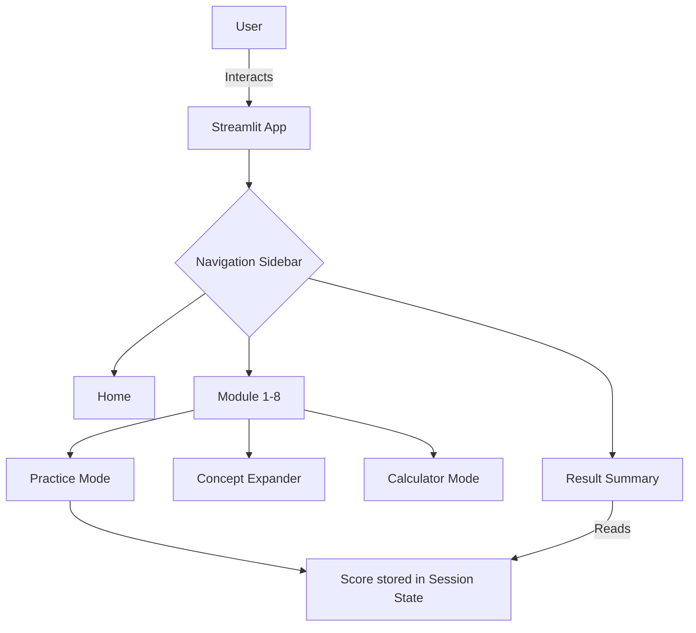

# Logic & Data Interpretation Learning App

## Abstract
This project is an interactive web-based educational platform designed to teach Logic and Data Interpretation. Built with Python and Streamlit, it features 8 distinct learning modules covering topics from Clock Problems to Scatter Diagram Analysis. Each module provides conceptual explanations, interactive calculators, and practice modes with auto-generated questions.

## Introduction
Data interpretation and logical reasoning are critical skills for analytical problem solving. This application serves as a comprehensive tool to help users practice these concepts through hands-on interaction and visual feedback.

## Objectives
- Create an engaging learning platform for logic and data interpretation.
- Provide step-by-step calculator modes to explain mathematical processes.
- Implement a practice mode with dynamic question generation and instant feedback.
- Offer visual representations using Plotly for better understanding.

## Problem Statement
Students often struggle with logical reasoning and data interpretation due to a lack of interactive practice tools. Traditional learning methods lack dynamic generation of questions and immediate, visually supported feedback.

## System Design
The application follows a modular architecture using Streamlit.
- **Frontend/Backend:** Streamlit handles both UI and backend logic in a unified Python script.
- **State Management:** `st.session_state` is used to persist user progress and generated questions.
- **Visualizations:** Plotly is used for interactive charts and diagrams.

### Flow Diagram

## Module Descriptions
1. **Clock Problems:** Calculates interior and reflex angles between hands.
2. **Calendar Problems:** Computes day of the week and leap year status.
3. **Figures & Pattern Recognition:** Generates number sequences (AP, GP, Fibonacci, etc.).
4. **Tabular Data Interpretation:** Analyzes structured data (sum, average, % change).
5. **Bar Graph Analysis:** Visualizes categorical comparisons with grouped/stacked bars.
6. **Pie Chart Analysis:** Calculates proportional angles and percentages.
7. **Line Graph Analysis:** Highlights trends and growth rates over time.
8. **Scatter Diagram Analysis:** Demonstrates correlation coefficients and regression.

## Algorithms & Formulas
- **Clock Angle:** `|30H - 5.5M|`
- **Day of the Week:** Zeller's congruence adaptation (Odd days method).
- **Percentage Change:** `((New - Old) / Old) * 100`
- **Pearson Correlation (r):** Scipy implementation to determine linear correlation.
- **Linear Regression:** `y = mx + c` (calculated via Numpy polyfit).

## Technologies Used
- Python 3.10+
- Streamlit
- Pandas & Numpy
- Plotly
- Scipy

## Screenshots
*(Placeholders)*
- `[Screenshot of Home Page]`
- `[Screenshot of Clock Calculator]`
- `[Screenshot of Result Summary]`

## Testing
| Test Case | Description | Expected Outcome | Actual Outcome | Status |
|---|---|---|---|---|
| TC01 | Calculate clock angle for 3:15 | Angle is 7.5° | Angle is 7.5° | Pass |
| TC02 | Determine day of week for 2024-02-29 | Thursday | Thursday | Pass |
| TC03 | Answer practice question correctly | Score increments, success message | Score increments, success message | Pass |
| TC04 | Answer practice question incorrectly | Error message with correct answer | Error message with correct answer | Pass |

## Limitations
- No persistent database; data is lost when the app is restarted.
- Limited question difficulty scaling.
- Single-user session per browser tab.

## Future Scope
- Integration with an SQL database (e.g., PostgreSQL/SQLite) for permanent user accounts and leaderboards.
- Addition of more complex reasoning topics like Syllogisms and Blood Relations.
- Implementation of an LLM-based tutor to explain incorrect answers dynamically.

## Conclusion
The Logic & Data Interpretation Learning App successfully provides a structured, interactive, and visually appealing way for users to practice and master quantitative concepts.

## References
- Streamlit Documentation: https://docs.streamlit.io/
- Plotly Python: https://plotly.com/python/
- Pandas Documentation: https://pandas.pydata.org/docs/
